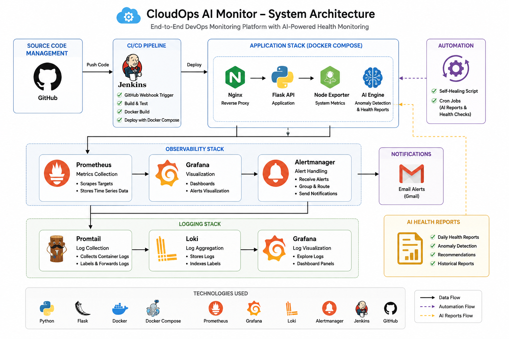
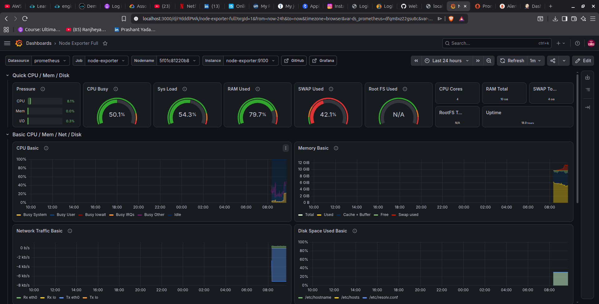
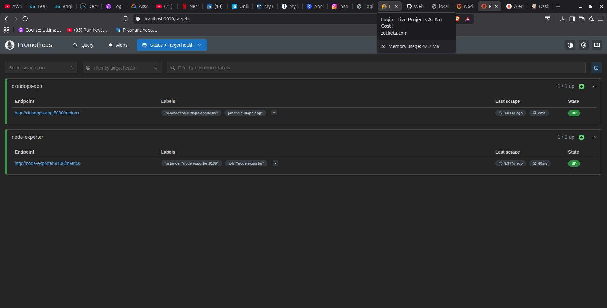
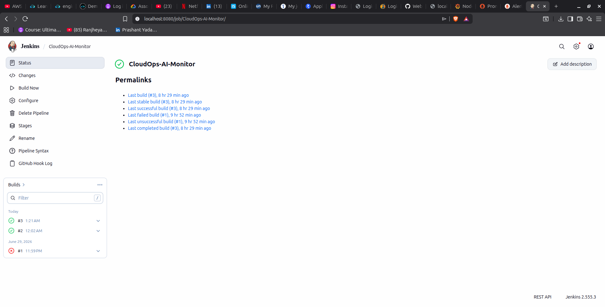
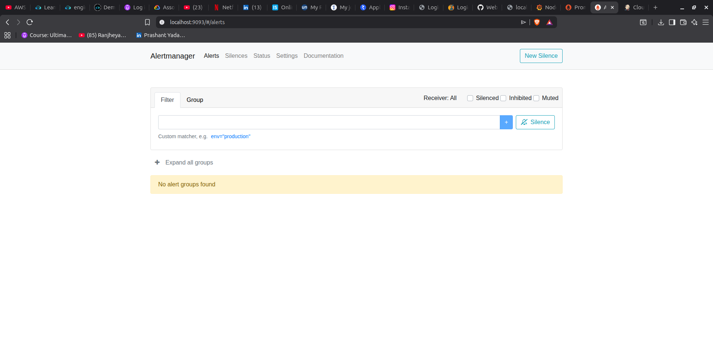

# 🚀 CloudOps AI Monitor

> A production-style DevOps and Cloud Monitoring Platform built with Docker, Prometheus, Grafana, Jenkins, Loki, Promtail, Alertmanager, and an AI-powered monitoring engine.


---

# 📌 Project Overview

CloudOps AI Monitor is an enterprise-style DevOps monitoring platform demonstrating modern cloud engineering practices.

This project integrates:

- Docker & Docker Compose
- Flask REST API
- Prometheus
- Grafana
- Loki
- Promtail
- Alertmanager
- Jenkins CI/CD
- GitHub Webhooks
- Self-Healing Automation
- AI Health Monitoring

The objective is to simulate how production systems are deployed, monitored, secured, and maintained in modern cloud environments.

---

# 🎯 Objectives

- Deploy containerized applications
- Monitor infrastructure and application metrics
- Collect system metrics
- Visualize metrics using Grafana
- Generate automated alerts
- Send Gmail notifications
- Centralize logs
- Perform self-healing
- Build CI/CD pipelines
- Detect anomalies using AI
- Generate automated health reports

---

# ✨ Features

## 🚀 Application
- Flask REST API
- Health Check Endpoint
- Prometheus Metrics Endpoint
- Dockerized Deployment

## 🐳 Containerization
- Docker
- Docker Compose
- Multi-container Architecture
- Nginx Reverse Proxy

## 📊 Monitoring
- Prometheus
- Grafana
- Node Exporter
- Infrastructure Monitoring

## 📜 Logging
- Loki
- Promtail
- Centralized Docker Log Collection

## 🚨 Alerting
- Alertmanager
- Gmail Email Notifications
- Application Down Alerts
- Infrastructure Alerts

## 🤖 AI Monitoring
- AI Anomaly Detection
- AI Health Report Generator
- Historical Report Storage
- Automated Recommendations

## ⚙️ Automation
- Self-Healing Script
- Cron Automation
- Automated AI Report Generation

## 🔄 CI/CD
- GitHub
- Jenkins Pipeline
- GitHub Webhooks
- Automatic Deployment

---

# 🏗️ System Architecture

The following diagram shows the complete architecture of the CloudOps AI Monitor platform.




```text
GitHub
   │
Git Push
   │
GitHub Webhook
   │
Jenkins
   │
Docker Compose
   │
────────────────────────────────────
│            │              │
Nginx     Flask App     AI Engine
│            │              │
└──────┬─────┘              │
       ▼                    │
  Prometheus                │
       │                    │
 ┌─────┼──────────────┐      │
 ▼     ▼              ▼      ▼
Grafana Loki     Alertmanager Health Reports
 │                   │
 ▼                   ▼
Dashboards      Gmail Alerts
```

---

# 🛠️ Technology Stack

| Category | Technology |
|----------|------------|
| Language | Python |
| Backend | Flask |
| Containers | Docker, Docker Compose |
| Reverse Proxy | Nginx |
| Monitoring | Prometheus |
| Dashboard | Grafana |
| Metrics | Node Exporter |
| Logging | Loki, Promtail |
| Alerting | Alertmanager |
| CI/CD | Jenkins, GitHub |
| AI | Python AI Engine |
| Operating System | Ubuntu Linux |

---

# 📂 Project Structure

```text
CloudOps-AI-Monitor/
│
├── ai-engine/
│   ├── anomaly_detector.py
│   ├── health_report.py
│   ├── Dockerfile
│   ├── requirements.txt
│   └── reports/
│
├── alertmanager/
├── app/
├── docs/
│   └── architecture/
├── grafana/
├── loki/
├── nginx/
├── prometheus/
├── promtail/
├── scripts/
│
├── docker-compose.yml
├── Jenkinsfile
├── README.md
└── .gitignore
```

---

# ⚙️ Installation

Clone the repository:

```bash
git clone https://github.com/Prashant12588/CloudOps-AI-Monitor.git
cd CloudOps-AI-Monitor
```

Start the application:

```bash
docker compose up --build -d
```

Verify running containers:

```bash
docker ps
```

---

# 🌐 Services

| Service | URL |
|---------|-----|
| Flask Application | http://localhost |
| Grafana | http://localhost:3000 |
| Prometheus | http://localhost:9090 |
| Alertmanager | http://localhost:9093 |
| Loki | http://localhost:3100 |
| Jenkins | http://localhost:8080 |

---

# 📊 Monitoring Capabilities

- Infrastructure Monitoring
- Application Monitoring
- AI Health Reports
- AI Anomaly Detection
- Centralized Logging
- Email Alerts
- Self-Healing
- CI/CD Automation

---

# 📸 Screenshots

## Grafana Dashboard



---

## Prometheus Targets



---

## Jenkins CI/CD Pipeline



---

## Alertmanager


---

# 🚀 Future Improvements

- Deploy on AWS EC2
- HTTPS with Let's Encrypt
- Kubernetes Deployment
- Terraform Infrastructure
- Slack / Microsoft Teams Notifications
- Multi-region Deployment

---

# 👨‍💻 Author

**Prashant Yadav**

Cloud & DevOps Engineer

### Skills

- Linux
- Docker
- Docker Compose
- Jenkins
- Git & GitHub
- Python
- Bash
- Prometheus
- Grafana
- Loki
- Alertmanager
- AI Monitoring

---

# 📄 License

This project is intended for educational and portfolio purposes.
